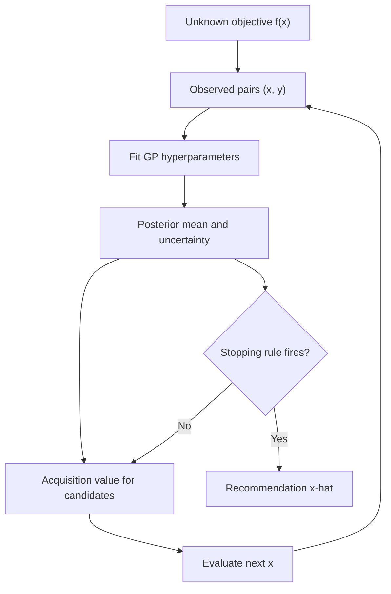

# BO Concept Map and One Numerical Example

## A concrete example

Suppose a chemistry experiment chooses temperature `x` and measures yield `y`.
After three experiments:

| `x` (°C) | observed yield |
|---:|---:|
| 40 | 0.31 |
| 60 | 0.72 |
| 90 | 0.49 |

The GP predicts two unevaluated candidates:

| candidate | posterior `μ` | posterior `σ` |
|---:|---:|---:|
| 65 | 0.74 | 0.05 |
| 78 | 0.66 | 0.18 |

For UCB with `sqrt(β)=2`:

- `UCB(65)=0.74+2(0.05)=0.84`
- `UCB(78)=0.66+2(0.18)=1.02`

BO evaluates 78°C next even though its mean is lower, because learning there is
more valuable. The new measured yield is added to the dataset, the GP is
refitted, and all acquisition values change.

## What BO actually finds

BO does not "choose the true function." It maintains a probability distribution
over possible functions and sequentially chooses evaluations. The final output
is an input `x`, selected by a recommendation rule. The GP approximates `f`; the
acquisition chooses the next experiment; the stopping rule decides when to end.

